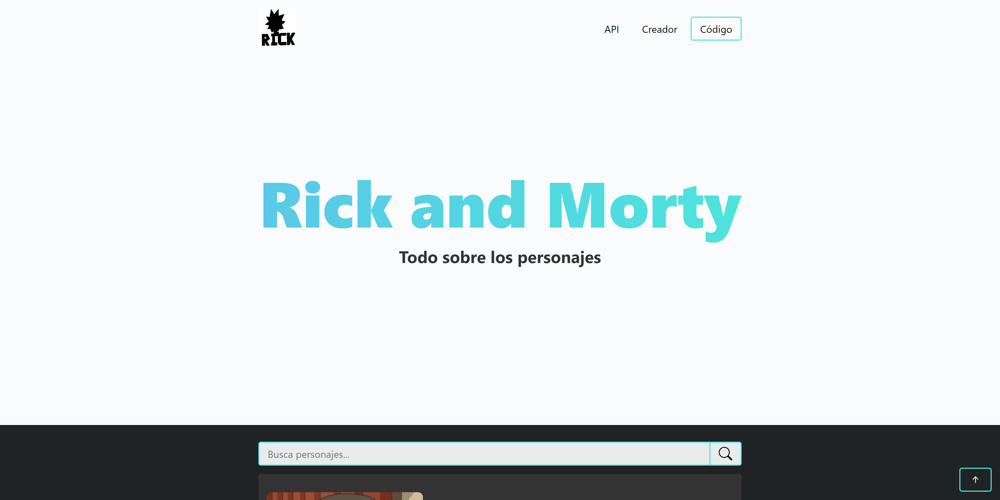
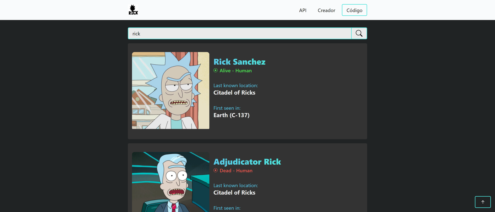

# Rick and Morty

Buscador de **personajes** de la serie **Rick and Morty** consumiendo una **api**.

👉 Enlace: [https://rick-and-morty-platform.netlify.app/](https://rick-and-morty-platform.netlify.app/)  
📢 Utilizando la API de: [rickandmortyapi.com](https://rickandmortyapi.com/)

  
  
  
  
  
  
  

## Personajes y contenido

👉 Busca y diviértete con todo el contenido de los personajes de Rick and Morty.

